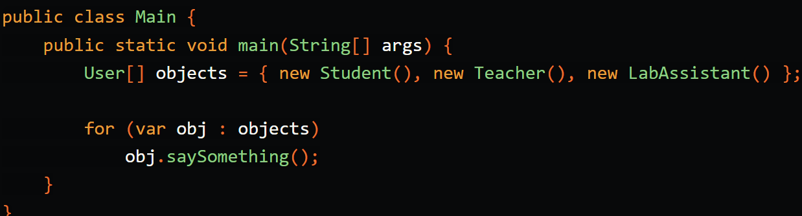

# typescript-solid

### let's start with the basics!

Object Oriented Programming (OOP) is a “method” of programming that involves using “objects”. These objects allow you to use that code again… and again… and again…! So that you don’t have to write them over and over!

### classes and objects
A class is what we would call the “blueprint” of the object. These classes or “objects” can use several techniques

### the Four pillars of Object Oriented Programming

1) #### Encapsulation
Encapsulation is the method of encapsulating data and methods (that use that data) in a single unit.

2) #### Abstraction
To understand this, you need to understand the English word "abstraction", and that pretty much means hiding or something similar. Therefore, in OOP, abstraction means hiding the complexity and exposing only what's necessary. Now, I'll use the previous code snippet and add abstraction to it.

Here, the difference is that salary field is made private, which means no objects can change the data. However, for whatever reason we want this salary to be read by any objects so the getSalary() method remains public and can be called by any objects. Basically, we're hiding the field because we don't want any objects to modify this salary in this case.

3) #### Inheritance
If a class has some implementation which is used by another class too, we've got some duplication over here. A quick fix to avoid this is to send the code up to a parent class and then both these classes will extend to the parent class and get the same implementation

implementation without inheritance:

Here, the problem is we've repeated some common codes between these two classes. It would be better if the common codes are present in a single place and these classes "connect" to the single place and yes it's possible with inheritance.

Here's how inheritance can make the codebase simpler:

This is much more cleaner. A student can getMarks(), while a teacher can setMarks(), and both of them can login(). No code repetition.
Use inheritance up to 1 or 2 levels only and when it wouldn't confuse anyone.

4) #### Polymorphism
Poly means many, morph means forms, and -ism is probably an English suffix to make words sound good. Polymorphism means that an object can take many forms.

Consider the following code:

Now, three distinct objects are created (which all have the saySomething() method with own implementation) and store them in an array:

In this case, we're looping over an array of different objects and then invoking saySomething() method. For element one, the object will invoke saySomething() in Student class, for element two, the object will invoke saySomething() in Teacher class, and so on. See? This object just took many forms, a.k.a polymorphism.
